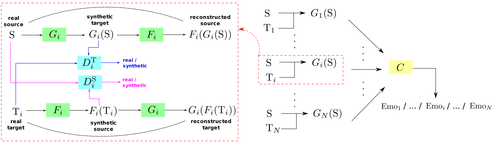
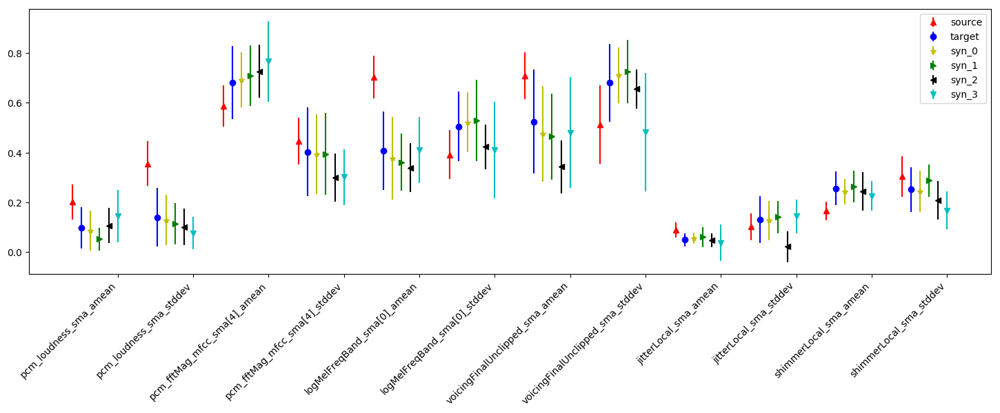
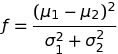
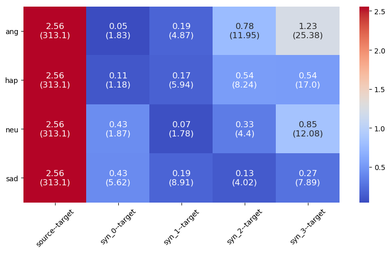
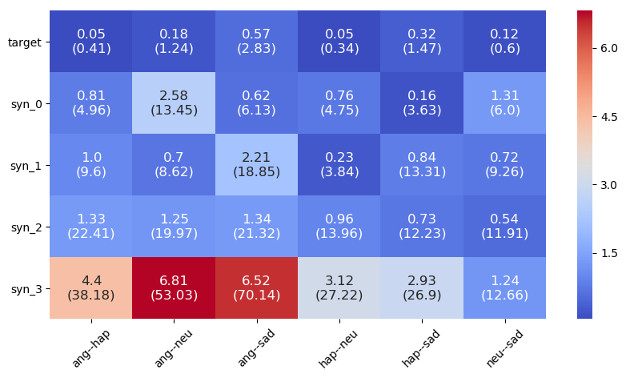
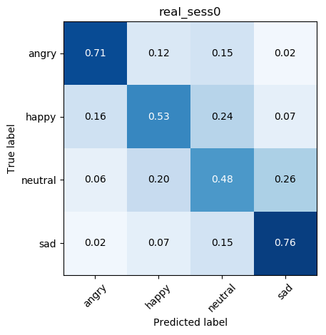

# CycleGAN-based Emotion Style Transfer as Data Augmentation for Speech Emotion Recognition


Tensorflow implementation of a CycleGAN-based framework to generate feature vectors via emotion style transfer.

Link to [Paper](https://www.isca-speech.org/archive/Interspeech_2019/pdfs/2293.pdf)


## Getting Started


### Environment

* Install [Miniconda](https://docs.anaconda.com/anaconda/install/)

* Clone this repository and switch to the directory
```
cd cyclegan-emotion
```
* Install environment in conda
```
conda env create -f environment.yml

```
* Activate the environment
```
conda activate tf_gpu
```

### Data and Features

* Install [openSMILE](https://www.audeering.com/opensmile/)

* Run the script files in the folder *feature_extraction* to extract 'emobase2010' reference feature set for each utterance in the database IEMOCAP (angry, happy, sad, neutral, excited), MSP-IMPROV and TEDLIUM (release 2), e.g.

```
perl audio_to_arff.pl iemocap.txt
```
will generate an openSMILE output file *iemocap.arff*.

Note, that you have to change the path to your openSMILE installation in audio_to_arff.pl, and adapt the configuration files according to your data paths and how the datasets are set up.

```
python arff_to_netcdf4.py [path_to_iemocap.arff] IEMOCAP
```
will generate a netcdf file *iemocap.nc*


## Synthetic Data Generation

Architecture of our model

 


### Configuration

* open the file *./scripts/config.py*, set the following paths

```
ROOT = <absolute_path_to_your_working_directory>
CORPUS = <path_to_your_netcdf_corpus_directory>
RESULTS = <path_to_your_output_directory>
SRC = ROOT + 'cyclegan-emotion/src/'
```

* Establish the following subfolders under the directory *RESULTS* for different kinds of outputs

```
├── cls
├── pretrain
└── train
    ├── losses
    └── syn_samples
```

**Note:** The output in *RESULTS* include models, classification results, parameters and losses. But all images will be generated in the directory *cyclegan-emotion/images/*


### Pre-training


* For pre-training the generator pairs, run the script:

```
python ./scripts/pretrain.py MODE [--dim_g DIM_G] [--lr LR] [--batch_size BATCH_SIZE] [--keep_prob KEEP_PROB] [--train_epochs TRAIN_EPOCHS]

```

Obligartory argument:

| Name | Type   | Description                                                                                                       |
| ---- | ------ | ----------------------------------------------------------------------------------------------------------------- |
| MODE | string | "inner" for inner corpus (cross validation), "cross" for cross corpus (combine all sessions)                      |

Optional arguments:

| Name         | Type  | Description             |                                                                                            
| ------------ | ----- | ----------------------- | 
| DIM_G        | list  | layer size of generator |
| LR           | float | learning rate           |
| BATCH_SIZE   | int   | batch size              |
| KEEP_PROB    | float | 1 - dropout             |
| TRAIN_EPOCHS | int   | training epochs         |


### Training

* For training the complete CycleGAN framework and generating synthetic samples, run the following script: 

```
python ./scripts/train.py MODE [--dim_g DIM_G] [--dim_d DIM_D] [--dim_c DIM_C] [--lr LR] [--batch_size BATCH_SIZE] [--keep_prob KEEP_PROB] [--train_epochs TRAIN_EPOCHS] [--lambda_cyc LAMBDA_CYC] [--lambda_cls LAMBDA_CLS]
```
Obligartory argument:

| Name | Type   | Description                                                                                                       |
| ---- | ------ | ----------------------------------------------------------------------------------------------------------------- |
| MODE | string | "inner" for inner corpus (cross validation), "cross" for cross corpus (combine all sessions)                      |

Optional arguments:

| Name         | Type  | Description                                              |                                                                                            
| ------------ | ----- | -------------------------------------------------------- | 
| DIM_G        | list  | layer size of generator                                  |
| DIM_D        | list  | layer size of discriminator                              |
| DIM_C        | list  | layer size of classifier                                 |
| LR           | dict  | learning rate for generator, discriminator and classifer |
| BATCH_SIZE   | float | batch size                                               |
| KEEP_PROB    | dict  | 1 - dropout for generator, discriminator and classifer   |
| TRAIN_EPOCHS | int   | training epochs                                          |
| LAMBDA_CYC   | float | weight for cycle consistency loss                        |
| LAMBDA_CLS   | float | weight for classification loss                           |


##  Experiments and Analysis

### Exp 1: Emotion Transfer - Similarity Analysis
* The following script computes different measures of similarity between real and synthetic feature distributions. By default, it requires different synthetic data sets to exist ('syn_total_5_0.h5', 'syn_total_5_1.h5', etc. where the first digit is the value of lambda_cyc, and the second lambda_cls). The script needs to be adapted accordingly, if only one synthetic dataset is present.

```
python ./scripts/exp1.py
```
It will generate:

- one plot that shows the mean and standard deviation of the source, target and synthetic data



- two different plots that present the overlap of distributions based on Fisher's discriminant ratio:



(not included in the original paper)

  - a) overlap between the data distribution of different datasets



  - b) overlap between the data distribution of different emotions




### Exp 2: Inner-Corpus Evaluation
The script exp2.py runs 5-fold cross-validation on IEMOCAP and outputs:

- a file consisting of mean and standard deviation of Unweighted Average Recall for the repeated evaluations (in *RESULTS/cls/*)

- a plot that shows the average of the confusion matrices for the repeated evaluations, e.g.



```
python ./scripts/exp2.py SESSION_ID TRAIN_ON SYN_DATA [--dim_c DIM_C] [--lr LR] [--batch_size BATCH_SIZE] [--keep_prob KEEP_PROB] [--train_epochs TRAIN_EPOCHS] [--repeated REPEATED]
```
Obligartory arguments:

| Name       | Type   | Description                                   |
| ---------- | ------ | --------------------------------------------- |
| SESSION_ID | int    | session id for test set in cross validation   |
| TRAIN_ON   | string | training dataset, 'real', 'syn' or 'real+syn' |
| SYN_DATA   | int    | lambda_cls for synthetic dataset              |

Optional arguments:

| Name         | Type  | Description                                 |                                                                                            
| ------------ | ----- | ------------------------------------------- | 
| DIM_C        | list  | layer size of classifier                    |
| LR           | float | learning rate                               |
| BATCH_SIZE   | int   | batch size                                  |
| KEEP_PROB    | float | 1 - dropout                                 |
| TRAIN_EPOCHS | int   | training epochs                             |
| REPEATED     | int   | number of repeated times for classification |


### Exp 3: Cross-Corpus Evaluation
This script runs cross-corpus evaluation (training on IEMOCAP, testing on MSP-IMPROV)

```
python ./scripts/exp3.py TRAIN_ON SYN_DATA [--dim_c DIM_C] [--lr LR] [--batch_size BATCH_SIZE] [--keep_prob KEEP_PROB] [--train_epochs TRAIN_EPOCHS] [--repeated REPEATED] [--f_names F_NAMES] [--dev_portion DEV_PORTION]
```
In addition to the arguments described in Exp. 2, there are the following arguments:

| Name         | Type  | Description                                 |                                                                                            
| ------------ | ----- | ------------------------------------------- | 
| F_NAMES      | list  | names of selected features                  |
| DEV_PORTION  | float | portion of development set                  |

The outputs are similar to those in Exp 2. 


## How to cite
If you use or reimplement any of this source code, please cite the following paper:
```
@InProceedings{cyclegan-emotion19,
title = {CycleGAN-based Emotion Style Transfer as Data Augmentation for Speech Emotion Recognition},
author = {Bao, Fang and Neumann, Michael and Vu, Ngoc Thang},
booktitle = {Proceedings of Interspeech},
location = {Graz, Austria},
year={2019}
}
```

## License
This project is licensed under the [GNU GENERAL PUBLIC LICENSE](LICENSE).

